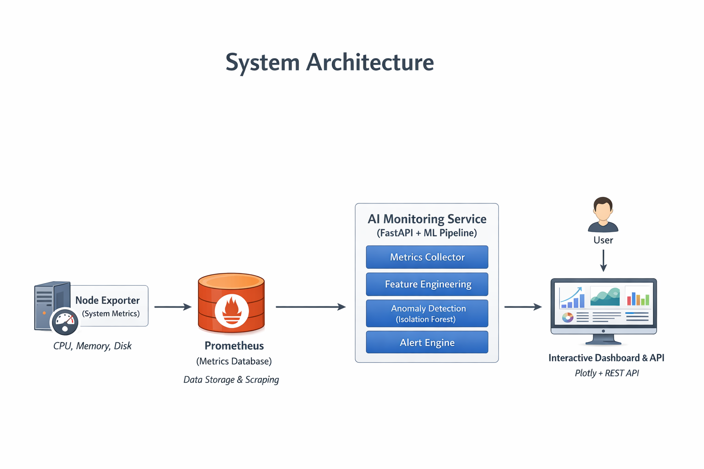

# AI System Monitoring & Anomaly Detection

An AI-powered system monitoring platform that collects system metrics, engineers time-window features, detects anomalies using machine learning, and visualizes system behavior through interactive dashboards.

---

## 🚀 Features

- System metrics collection (CPU, Memory, Disk)
- Time-window feature engineering
- Unsupervised anomaly detection (Isolation Forest)
- Continuous monitoring pipeline
- REST API built with FastAPI
- Interactive dashboards using Plotly
- Alert generation for anomalous behavior

---

## 🏗 Architecture Overview

System Metrics
↓
Collectors
↓
Preprocessing & Feature Engineering
↓
ML Anomaly Detection
↓
Alerts + API
↓
Interactive Dashboard

## 🏗 System Architecture

<p align="center">
  
</p>
---

## 📂 Project Structure

api/ → FastAPI endpoints
collectors/ → Metrics collection from Prometheus
preprocessing/ → Aggregation & time-window features
ml/ → Anomaly detection model
alerts/ → Alert generation logic
dashboards/ → Static & interactive dashboards
runner/ → Orchestrates the monitoring pipeline
data/ → Runtime-generated data (ignored in Git)
monitoring/
├── docker-compose.yml
└── prometheus.yml


---

## 🚀 Run Using Docker (Recommended)

This project is fully reproducible using Docker Compose.

### Prerequisites

- Docker
- Docker Compose

---

### Steps

```bash
git clone https://github.com/athulnn/aiops.git
cd aiops/monitoring
docker compose up --build

```

## 🧪 Sanity Check

After running Docker Compose:

docker ps

You should see three containers running:

## 📡 API Endpoints

Base URL: http://localhost:8000

GET /  
Service status

GET /health  
Health check

GET /anomalies?limit=10  
Fetch latest detected anomalies

GET /alerts  
Fetch generated alerts

GET /dashboard  
View static PNG dashboard

GET /dashboard/interactive  
View interactive HTML dashboard

Notes:
- Monitoring runs continuously in the background
- Data and anomalies appear after a few minutes of runtime
- APIs are exposed via FastAPI


## 📌 Notes

Runtime-generated CSV files and images are excluded from Git.

Prometheus communicates with services using Docker service names.

The system is designed for learning, experimentation, and AIOps workflows.


## 📈 Future Enhancements

Prometheus alert rules

Grafana dashboards

Multi-node monitoring

Online learning models

Cloud deployment (AWS / Azure)